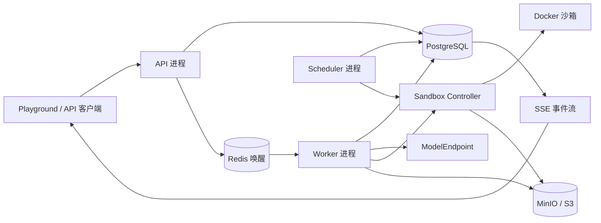
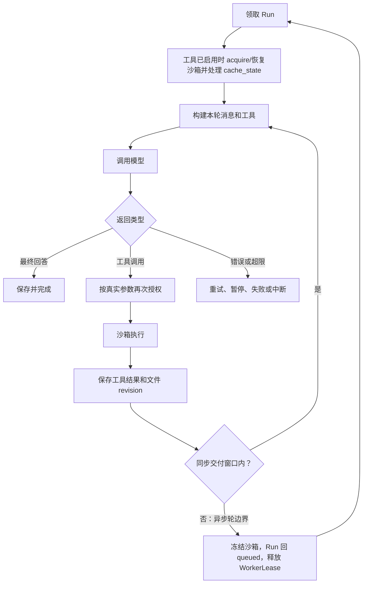

# tiny-hermes M1 技术设计

> 日期：2026-08-10  
> 版本：v1.1  
> 状态：已确认，可进入分阶段实施  
> 对应产品设计：[tiny-hermes 产品与系统设计 v2.4](./2026-08-09-tiny-hermes-product-design.md)  
> 目标版本：M1 / 0.1 Technical Preview

## 1. 文档目的

本文把产品设计中的 M1“单 Agent 安全运行骨架”细化为可以继续拆分实施任务的技术方案，固定以下内容：

- 进程与模块边界。
- 数据对象、并发不变量和事务边界。
- 单 Agent 模型与工具循环。
- Docker 沙箱生命周期与文件恢复。
- 身份、权限、API 和错误格式。
- 最小管理控制台。
- 开发、部署、日志、测试与验收方式。

产品设计 v2.4 仍是产品范围和状态语义的权威来源。本文只细化 M1；两份文档冲突时必须先修订文档，不能由实现者自行选择。

## 2. M1 范围

### 2.1 必须交付

- 本地账号、初始化管理员、工作空间、成员和固定角色。
- ServiceAccount、API Key scope 和可撤销登录会话。
- Agent 草稿、校验、不可变发布版本和回滚。
- OpenAI 兼容 ModelEndpoint 和 Provider 中立消息格式。
- Session FIFO、Run 状态机、幂等、事件、暂停、继续、取消和 failed Run 安全重试。
- WorkerLease、Scheduler 超时扫描与 Session 队首修复。
- 单 Agent 模型循环。
- 文件与受限命令工具。
- 强制 Docker 沙箱、SessionWorkspace revision 和 Artifact。
- Runs API、SSE、Chat Completions 和最小 Web 控制台。
- AuditEvent、Secret 信封加密基础流程和统一安全出站客户端。
- Docker Compose、本地开发流程、自动化测试和 M1 性能基准。
- 飞书 WebSocket 长连接技术验证记录；不交付飞书产品适配器。

### 2.2 不在 M1 交付

- 自动 Goal 判断器和长周期自主 Goal 循环。
- 子 Agent、任务树和群体编排。
- 长期记忆、会话搜索和上下文压缩。
- 技能目录、技能提案和自动安装或修改技能。
- MCP、OpenAPI、通用 HTTP 工具和沙箱联网。
- 完整人工审批系统。
- 跨 Provider 自动备用模型切换。
- OIDC、飞书正式适配、独立终端用户 Chat Web。
- 完整 Approvals、Usage、Audit 查询导出页面。
- 独立 egress-proxy、Kubernetes 和多主机沙箱。
- 货币费用安全阀；M1 只记录可用的 Token 用量并强制时间、次数和输出限制。

M1 可以不交付审批系统，是因为工具能力被限制在当前 Session 的 `/workspace/data` 和无网络沙箱，AgentVersion 发布时已经固定授权范围。M1 不允许访问共享、生产或他人文件，不允许外部写操作，也不允许运行中扩大权限；超出边界直接拒绝。后续引入这些能力前必须先实现产品设计 §16.3 的审批流程。

## 3. 架构

### 3.1 总体结构

M1 使用一个代码仓库和共享后端代码，但运行时拆成独立进程：



### 3.2 进程职责

| 进程 | 负责 | 禁止 |
|---|---|---|
| API | 身份、权限、输入校验、管理用例、创建 Session/Run、查询和 SSE | 执行 Agent Loop、运行工具、访问 Docker socket |
| Worker | 领取 Session head Run、模型调用、工具编排、检查点和事件 | 绕过 Run 状态机、直接访问 Docker socket、在宿主机执行工具 |
| Scheduler | 租约回收、等待与兼容超时、幂等和保留期清理、队首修复 | 正常执行 Run、充当业务队列真相 |
| Sandbox Controller | 创建、冻结、解冻、销毁沙箱和执行受控工具请求 | 接受任意宿主机路径、任意 Docker 参数或任意网络模式 |
| Web | 管理控制台和 Playground | 保存业务真相、自己决定 Run 状态 |

PostgreSQL 是业务状态的唯一可信来源。Redis 只用于降低 Worker 发现新任务的延迟；通知丢失后，Worker 仍通过数据库轮询发现任务。MinIO/S3 只保存文件、产物和较大内容，不保存 Run 当前状态。

### 3.3 安全信任边界

- API、Worker、Scheduler 和 Sandbox Controller 是平台可信进程，但仍按最小权限部署。
- 模型输出、终端用户输入、Agent 配置、工具参数和沙箱内代码均视为不可信内容。
- Docker socket 只挂载给 Sandbox Controller。
- API、Web、模型、Worker 和工具沙箱均不能直接访问 Docker socket。
- M1 工具沙箱无网络；平台可信进程的动态目标通过 SafeOutboundClient 访问。
- 沙箱失败时不存在宿主机执行回退路径。

## 4. 仓库与模块结构

### 4.1 目录

```text
tiny-hermes/
├─ apps/
│  ├─ api/
│  ├─ worker/
│  ├─ scheduler/
│  ├─ sandbox-controller/
│  └─ web/
├─ packages/
│  └─ backend/
│     ├─ src/tiny_hermes/
│     │  ├─ identity/
│     │  ├─ agents/
│     │  ├─ sessions/
│     │  ├─ runs/
│     │  ├─ providers/
│     │  ├─ tools/
│     │  ├─ sandbox/
│     │  ├─ audit/
│     │  └─ shared/
│     └─ tests/
│        ├─ unit/
│        ├─ integration/
│        └─ contract/
├─ tests/
│  ├─ e2e/
│  └─ performance/
├─ deploy/
│  ├─ compose/
│  └─ images/
└─ docs/
```

M1 后端是一个 Python 发布单元，四个进程使用不同启动入口。首阶段不把各业务模块拆成独立 Python 包，避免本地开发和版本管理复杂化。

### 4.2 模块内部结构

每个核心模块使用相同依赖方向：

```text
module/
├─ domain/          # 状态、值对象、业务规则
├─ application/     # 用例和事务编排
├─ ports/           # 数据库、时钟、模型、沙箱等接口
└─ infrastructure/  # SQLAlchemy、Redis、SDK 等实现
```

规则：

- `domain` 不导入 FastAPI、SQLAlchemy、Redis、Docker SDK 或 Provider SDK。
- `application` 只通过 `ports` 使用外部能力。
- `infrastructure` 实现端口并负责第三方格式转换。
- API、Worker 和 Scheduler 调用同一组 application 用例，不复制状态转换逻辑。
- 模块不得绕过其他模块的公开用例直接查询其私有表。
- `shared` 只放真正跨模块稳定的 ID、时间、分页、错误和事务接口，不成为无边界杂物目录。

## 5. 技术基线

### 5.1 后端

- Python 3.12。
- uv 管理环境、依赖和锁文件。
- FastAPI、Pydantic、SQLAlchemy 2、Alembic。
- PostgreSQL、Redis、MinIO/S3。
- pytest、Ruff、Pyright。

### 5.2 前端

- Node.js 24 LTS。
- pnpm，并通过 `packageManager` 固定包管理器版本。
- React、TypeScript、Vite、Ant Design。
- TanStack Query、React Router、Monaco Editor。
- Vitest、Testing Library、Playwright、ESLint。

写入锁文件和容器镜像前，实施阶段必须从各项目官方发布信息确认具体补丁版本和仍受支持状态。Compose 和 CI 不使用浮动 `latest` 标签。

## 6. 数据模型

### 6.1 身份与租户

| 表 | 关键内容 |
|---|---|
| `users` | 管理用户状态、显示名、创建时间 |
| `auth_identities` | local 身份类型、稳定 subject、密码摘要；为 M3 OIDC 保留 provider 字段 |
| `auth_sessions` | 随机会话摘要、User、到期和撤销时间 |
| `workspaces` | 租户名称、状态和设置 |
| `memberships` | User、Workspace、固定角色，唯一键为 `workspace_id + user_id` |
| `service_accounts` | Workspace 下稳定的服务调用主体 |
| `api_keys` | Key 摘要、可识别前缀、ServiceAccount、scope、到期和撤销状态 |

API Key 明文只在创建时返回一次。M1 的调用主体只有 User 与 ServiceAccount；Session、Run、AuditEvent 和 IdempotencyRecord 使用 `caller_type + caller_id` 引用稳定主体，不使用可轮换的 API Key ID。EndUser 与 ExternalIdentity 随终端用户渠道在后续里程碑加入，M1 不保留悬空外键或假身份。

### 6.2 Agent 与配置

| 表 | 关键内容 |
|---|---|
| `agents` | Workspace 下稳定 Agent 身份、别名和当前发布版本 |
| `agent_drafts` | 可修改配置、修订号和最后编辑者 |
| `agent_versions` | 不可变规范化配置、`schema_version`、内容哈希和发布者 |
| `model_endpoints` | 类型、`base_url`、模型能力、上下文窗口、最大输出和 `usage_quality` |
| `secrets` | 业务密文、包装后的 DEK、KEK `key_id`、范围和状态 |

AgentVersion 的人格、模型策略、工具绑定和安全限制保存为经过 Schema 校验的规范化快照。发布和回滚只切换 Agent 当前版本指针，不修改历史版本。

### 6.3 Session 与 Run

| 表 | 关键内容 |
|---|---|
| `sessions` | Workspace、Agent、`session_mode`、`caller_type + caller_id`、`head_run_id` 和下一个序号 |
| `session_messages` | CanonicalMessage、顺序、来源 Run 和脱敏标记 |
| `runs` | 状态、`state_version`、`next_event_sequence`、Session 序号、阻塞关系、`retry_of_run_id`、`budget_root_run_id`、检查点和时间字段 |
| `run_budget_scopes` | 根 Run、模型/工具/Token/累计执行时间/墙钟期限上限与已消费值、派生重试计数和版本 |
| `run_events` | `run_id + sequence`、事件类型、脱敏 payload 和发生时间 |
| `worker_leases` | Run、Worker、租约开始、过期和续租版本 |
| `idempotency_records` | Workspace、`caller_type + caller_id`、endpoint、Key、请求指纹、Run 和到期时间 |
| `audit_events` | 调用者、Workspace、资源、动作、结果、请求 ID 和脱敏上下文 |

约束：

- `Session.head_run_id` 必须指向该 Session 中 `session_sequence` 最小的非终态 Run；没有非终态 Run 时为 `null`。
- 每个 Session 的 `session_sequence` 单调递增且唯一。
- 非 head 的非终态 Run 保存 `blocked_by_run_id=head_run_id`。
- 每次 Run 状态变化使用 `state_version` 做并发比较。
- 根 Run 的 `budget_root_run_id` 指向自身；派生重试继承原值并保存直接来源 `retry_of_run_id`。
- `run_budget_scopes.root_run_id` 唯一；重试数和所有已消费预算只在该行原子更新。
- `runs.next_event_sequence` 是该 Run 的下一个可分配事件序号，初始为 1。
- `run_events` 对 `run_id + sequence` 建唯一约束。
- 同一 Run 同时最多有一个有效 WorkerLease。
- 时间以 UTC 保存。

### 6.4 沙箱与文件

| 表 | 关键内容 |
|---|---|
| `sandbox_reservations` | Run、SandboxInstance、状态、空闲到期和隔离原因 |
| `sandbox_instances` | Controller 内部实例 ID、镜像摘要、状态和资源档位，不保存任意宿主机路径 |
| `workspace_revisions` | Session、父 revision、对象清单哈希、提交 Run 和提交时间 |
| `object_uploads` | `upload_id`、Workspace、Session、Run、staging 前缀、状态、创建和提交时间 |
| `artifacts` | Workspace、Run、对象引用、媒体类型、大小和内容哈希 |

SessionWorkspace 只对应 `/workspace/data`。`/workspace/cache` 和 `/tmp` 不进入 WorkspaceRevision。

## 7. 核心事务与并发

### 7.1 创建 Run

同一事务执行：

1. 先对 `workspace_id + caller_type + caller_id + endpoint + idempotency_key` 执行 `INSERT ... ON CONFLICT DO NOTHING RETURNING id`。该组合有数据库唯一约束，不能先查询再决定插入。
2. 插入成功后锁定 Session 行，分配下一个 `session_sequence`。
3. 没有 head 时把新 Run 设为 head；已有 head 时保存阻塞关系。
4. 普通根 Run 创建 `run_budget_scopes`，并把自身 ID 写入 `budget_root_run_id`。
5. 通过 §7.7 的分配器写 Run 创建事件和需要的审计事件。
6. 把新 Run ID 和响应摘要写回幂等记录。

并发请求未插入幂等记录时，等待冲突事务结束后读取已有记录：请求指纹相同则返回原 Run，指纹不同返回 409。首个事务回滚时，其幂等记录和 Run 一起回滚，等待者可以重新竞争。事务提交后再发送 Redis 唤醒。

### 7.2 Worker 领取

Worker 只领取满足全部条件的 Run：

- 状态为 `queued`。
- Run ID 等于所属 Session 的 `head_run_id`。
- 没有未过期的 WorkerLease。
- `blocked_by_run_id` 为空。

领取使用数据库行锁和跳过已锁行的查询。同一事务创建租约、执行 `queued → running`、递增 `state_version` 并写事件。

### 7.3 保存检查点

一个检查点步是一次模型调用、一次工具调用或一次 M1 轮结束。保存时：

- 核对 WorkerLease 和 `state_version`。
- 保存 CanonicalMessage、工具结果、用量、外部影响标记和下一步。
- `/workspace/data` 有变化时，先创建 ObjectUpload，按 `staging/{workspace_id}/{upload_id}/` 上传对象，再对当前 `workspace_revision` 做 CAS。
- 通过 §7.7 分配连续 RunEvent 序号。
- 最后提交检查点和状态。

Workspace revision 冲突写 `workspace_conflict` 事件并进入 `interrupted`，不能覆盖新 revision。

WorkspaceRevision 提交事务同时把 ObjectUpload 标为 `committed`。进程在上传后、事务提交前退出时，ObjectUpload 仍是 `staging`；Scheduler 只扫描超过默认 24 小时的 staging 记录，确认没有 revision 引用后按登记前缀删除。平台可以在 1 小时到 7 天范围内调整保留时间，不进行全桶扫描猜测孤儿对象。

### 7.4 终态与队首交接

同一事务：

1. 锁定 Session。
2. 把当前 Run 写入 `completed`、`failed` 或 `cancelled` 并写最终事件。
3. 选择最小的后续非终态 `session_sequence`。
4. 新 head 的 `blocked_by_run_id` 置空，其他非终态 Run 指向新 head。
5. 不存在非终态 Run 时把 `head_run_id` 置空。

已终态 Run 永远不能成为新 head。事务提交后再唤醒 Worker。

### 7.5 派生安全重试

`POST /api/v1/runs/{run_id}/retry` 只接受 `failed` Run，并要求 `Idempotency-Key`。创建前必须确认最后检查点标记为 `replay_safe=true`，没有结果不明确的外部副作用；来源还必须是所属 Session 最新 Run，且 SessionWorkspace 当前 revision 等于来源检查点 revision。任一上下文条件不满足时返回 409 `retry_context_stale`，不把旧上下文插回已经前进的会话；`interrupted` Run 使用原 Run 的 `interrupted → queued` 恢复路径，不创建重试 Run。

同一事务：

1. 按 §7.1 先竞争幂等记录。
2. 锁定来源 Run、所属 Session 和 `run_budget_scopes` 根行。
3. 校验当前主体权限、检查点安全性、剩余预算和 `derived_retry_count < max_derived_retries`。
4. 原子递增根预算的重试计数。
5. 在原 Session 分配新的 `session_sequence`，创建 Run，写 `retry_of_run_id=来源 Run` 和原 `budget_root_run_id`。
6. 只继承明确授权的 CanonicalMessage、WorkspaceRevision 和 Artifact 引用，从失败步骤之前最后一个完整检查点继续。
7. 写来源与新 Run 的事件并完成 FIFO 阻塞关系。

默认最大派生重试数为 3。并发点击在同一根预算行串行校验，超过上限的请求返回 409 `retry_limit_reached`，不能各自获得新预算。

### 7.6 Scheduler 修复

Scheduler 检查：

- head 指向终态或不存在的 Run。
- head 为空但仍存在非终态 Run。
- head 不是最小非终态 Run。
- pending Run 的 `blocked_by_run_id` 错误。
- 过期 WorkerLease 和隔离中的 SandboxInstance。
- `wait_deadline_at` 和 `paused(compat_timeout)` 24 小时清理。
- 到期 IdempotencyRecord、保留期数据和无引用对象。

修复前锁定 Session 并重新读取。实际修复写 `session_head_repaired` AuditEvent；存在新 head 时同时写同名 RunEvent。

多 Scheduler 使用 PostgreSQL advisory lock 选择当前扫描者；具体记录仍使用行锁和状态版本，避免重复副作用。

### 7.7 RunEvent 序号分配

API、Worker 和 Scheduler 共用 `RunEventSequenceAllocator`。写入同一 Run 的 `n` 个事件时，在事件事务中执行一次原子更新：把 `runs.next_event_sequence` 增加 `n`，并通过 `RETURNING` 取得本次预留区间。事件使用该连续区间，`run_id + sequence` 仍有唯一约束。

不得使用 `max(sequence) + 1`。若唯一约束冲突，说明分配器或数据已不一致，当前事务必须回滚，重新读取 Run 后最多重试 3 次；仍冲突则返回或记录 `event_sequence_conflict` 并停止当前状态变更，不能跳过事件继续。

## 8. Run 状态与调度

### 8.1 状态来源

M1 使用产品设计 v2.4 §11.2 和 §11.3 的完整状态及权威转换矩阵。实现中只有 `runs.domain.RunStateMachine` 可以决定状态转换；API、Worker、Scheduler 和数据库仓储均不能绕过它直接设置状态。

### 8.2 检查点与时间片

- 检查点步决定故障后能恢复到哪里。
- 异步执行时间片决定 Worker 何时让出执行权。
- 异步 `max_slice_seconds` 默认 30 秒，可在 10–300 秒范围内由平台调整，工作空间只能调低。
- 一个 Goal 轮结束或时间片到期后的下一个安全检查点，Run 可以 `running → queued` 并释放 WorkerLease。
- 检查点不会自动销毁或重建沙箱。
- Chat Completions 同步 Run 在最长 60 秒交付窗口内不因普通轮边界重新排队。

### 8.3 两种时间限制

- `max_execution_seconds`：累计持有有效 WorkerLease 且 Run 处于 `running` 的实际执行时间，M1 默认 900 秒。排队、暂停和等待不消耗该预算；每次租约结束或检查点都把本段时长原子累计到根预算。
- `max_elapsed_seconds`：从根 Run 创建到当前的自然时间，M1 默认 24 小时。它限制长期排队和反复调度，不因为 Worker 繁忙而消耗执行预算。

任一限制到达后不再开始新的模型或工具调用。`queued` 或 `running` Run 在安全点进入 `paused(limit)`；已经 paused、waiting 或 interrupted 的 Run 保持更能说明现场的原状态，但 `available_actions` 不再包含继续，直到有权限主体扩大根预算并写 AuditEvent。

### 8.4 等待、暂停和终态

进入 `waiting_approval`、`waiting_external`、`paused` 或任何终态前，必须：

- 到达安全检查点。
- 保存明确结果。
- 提交 `/workspace/data`。
- 销毁 SandboxInstance。
- 释放 WorkerLease 和 SandboxReservation。

无法确认上述步骤时进入 `interrupted`。

## 9. M1 Agent 内核

### 9.1 组件

| 组件 | M1 职责 |
|---|---|
| PromptBuilder | 拼装服务端安全规则、人格、历史、当前请求和工具 schema |
| ModelProvider | 接收 CanonicalMessage，返回流式文本、工具调用、结束原因和 usage |
| ToolRegistry | 返回本轮授权后的文件和命令工具 |
| AgentLoop | 执行模型、工具、检查点和完成判断 |

M1 不实现 MemoryStore、SkillLoader、独立 Goal 判断器和上下文压缩器的产品能力；后续模块可以接入当前公开接口，不能把未实现行为伪装为可用。

### 9.2 CanonicalMessage

M1 运行时支持：

- 文本块。
- 工具调用块，包含平台稳定调用 ID、工具名和 JSON 参数。
- 工具结果块，必须引用对应调用 ID。

数据结构为图片和附件引用保留可识别类型，但 M1 Adapter 对未支持内容返回明确 `content_type_not_supported`，不能静默丢弃。

Provider Adapter 负责：

- 系统消息位置转换。
- 流式分片合并。
- 工具调用参数组装和校验。
- 停止原因规范化。
- usage 规范化和质量标记。

平台不要求或保存 Provider 隐藏推理内容。

### 9.3 M1 循环



模型返回最终回答且没有工具调用时，M1 将本轮视为完成。返回工具调用时执行工具并继续。M1 不做跨 Provider 自动切换；当前轮尚未产生可见输出或副作用时，可以对同一端点的限流和短暂网络错误默认最多尝试 3 次，使用带随机抖动的指数退避。工作空间只能调低次数。

### 9.4 默认限制

| 限制 | 实例默认值 |
|---|---:|
| 最大累计执行时间 `max_execution_seconds` | 15 分钟 |
| 最大墙钟期限 `max_elapsed_seconds` | 24 小时 |
| 最大模型调用次数 | 20 |
| 最大工具调用次数 | 50 |
| 单个命令超时 | 60 秒 |
| Chat Completions 同步上限 | 60 秒 |
| 文件工具单次读取 | 2 MiB |
| 文件工具单次写入 | 10 MiB |
| 命令输出进入消息的上限 | 1 MiB |
| 最大派生重试次数 | 3 |

默认值属于实例配置，工作空间只能调低。ModelEndpoint 最大输出是额外硬上限。

`usage_quality=provider` 使用 Provider usage；`estimated` 只使用经验证匹配该模型的 tokenizer；`unavailable` 不伪造 Token 数。usage 不可用时仍强制时间、调用次数和单次输出限制。要求严格 Token 上限的 AgentVersion 不能选择 usage 不可用的端点。

## 10. M1 工具

### 10.1 工具清单

- `file.list`
- `file.read`
- `file.write`
- `shell.exec`

### 10.2 两次授权

1. 工具 schema 暴露给模型前，按 Workspace、AgentVersion、调用主体和 Run 策略过滤。
2. 执行前，按真实工具名、路径、工作目录、参数和资源限制再次检查。

未绑定工具返回 `tool_not_authorized`，不调用底层实现。M1 工具权限在 AgentVersion 发布时明确绑定，不提供运行中扩权审批。

### 10.3 文件工具

- 允许路径限定在 `/workspace/data`。
- 拒绝绝对路径、越级路径、越界符号链接和绑定挂载逃逸。
- 读取和写入均限制单次大小。
- 写入采用临时文件加同目录替换，避免正常失败留下半个文件。
- 写工具成功后必须提交 WorkspaceRevision 才能完成检查点。

### 10.4 命令工具

- 只能通过 Sandbox Controller 在目标 SandboxInstance 内运行。
- 请求使用 `command`、`cwd` 和可选 `timeout_seconds`；`command` 由沙箱内 `/bin/bash -lc` 执行，不能携带宿主机环境变量或 Docker 参数。
- 工作目录必须位于允许的 workspace 目录。
- 使用非 root 用户，无网络，并继承容器资源限制。
- 每次调用有超时、输出字节、文件数和磁盘限制。
- 正常超时返回明确 `command_timeout` 工具结果。
- 超长输出保存为 Artifact，消息中保留截断说明和引用。
- 沙箱或连接中断导致结果不明确时，Run 进入 `interrupted`。

运行环境默认把依赖目录、虚拟环境和构建缓存导向 `/workspace/cache`，把锁文件和重建配置保存在 `/workspace/data`。

## 11. Sandbox Controller

### 11.1 内部接口

M1 单机 Compose 使用只挂载给 Worker、Scheduler 和 Controller 的 Unix domain socket。Controller 只提供以下受限动作：

- `acquire(run_id, worker_lease_id, agent_version_id, workspace_revision_id, resource_profile)`
- `execute(run_id, worker_lease_id, sandbox_id, tool_request)`
- `freeze(run_id, worker_lease_id, sandbox_id)`
- `thaw(run_id, worker_lease_id, sandbox_id)`
- `destroy(run_id, worker_lease_id, sandbox_id)`
- `inspect(run_id, sandbox_id)`

调用者不能提供任意宿主机路径、Docker capability、Docker socket、镜像外的任意挂载或网络模式。Controller 根据数据库中的 AgentVersion、Run 和平台资源档位生成 Docker 配置。

每次操作都先校验 SandboxReservation 的 `run_id + sandbox_id` 所有权；`acquire` 在实例尚未创建时校验 Run 当前没有其他有效 Reservation。Worker 发起的 `acquire`、`execute`、`inspect`、`freeze`、`thaw` 和 `destroy` 都必须再校验 `worker_lease_id` 属于同一 Run、尚未过期且当前有效。Scheduler 在租约过期后使用独立 `sandbox.cleanup` 内部权限执行 inspect/freeze/destroy，仍必须匹配 Run 与 Reservation，并写 AuditEvent。仅能连接 Unix socket 不能替代这些校验。

### 11.2 容器最低策略

- 非 root 用户。
- 只读根文件系统。
- `no-new-privileges`。
- 删除全部非必需 Linux capabilities。
- 默认无网络。
- CPU、内存、磁盘、进程数和时间限制。
- `/tmp` 使用受限 tmpfs 或临时盘。
- 只挂载本 Run 的 `/workspace/data` 和 `/workspace/cache` 可写层。
- Secret 只在需要时短期注入，不写文件、提示词或日志。

M1 默认资源档位为 1 vCPU、1 GiB 内存、128 个进程、2 GiB 可写磁盘和 256 MiB `/tmp`。平台管理员可以配置更高实例上限；AgentVersion 和工作空间只能选择不超过实例上限的档位。

### 11.3 文件分区

- `/workspace/data`：SessionWorkspace 持久数据，每个可能修改它的检查点做 revision CAS。
- `/workspace/cache`：依赖和构建缓存，只在当前保温 SandboxInstance 中存在。
- `/tmp`：完全临时，销毁后丢弃。
- SandboxBaseSnapshot：M1 中仅指平台发布流程预构建的运行时 Docker 镜像层，缓存键为不可变镜像 digest 加 CPU 架构。它不包含 AgentVersion 专属依赖、用户数据、Secret 或可写状态，也不存在由 Agent 输入触发的快照构建流程。

不同 Run 必须新建独立可写层。相同 Session 的连续 Run 也不能共享 cache、`/tmp`、后台进程、Secret 或可写容器状态。

运行时镜像由项目发布流水线构建和扫描，部署时按 digest 拉取；Sandbox Controller 只允许实例配置中已批准的 digest，不能接受 Agent 指定镜像。M1 不建立独立快照存储或自动淘汰器，镜像容量沿用 Docker 主机的部署运维策略；升级文档要求至少保留当前版本和可回滚版本使用的 digest，应用不得自动 prune 正在引用的镜像。

工具已启用的 Run 在每个执行时间片第一次模型调用前调用 `acquire`，由 Controller 新建或恢复环境并返回 `cache_state=reused|reset`。只有同一 Run 在 `sandbox_idle_ttl` 内解冻原 SandboxInstance 时为 `reused`；新建 SandboxInstance，包括同 Session 的下一 Run，均为 `reset`。Worker 收到 `reset` 后先写 `sandbox_cache_reset` RunEvent，并在本时间片第一次模型调用前加入受保护的运行时提示，明确依赖、虚拟环境、后台进程和构建缓存需要重建；不在 `/workspace/data` 写伪装成用户文件的标记。没有工具绑定的 Run 不为此提前创建沙箱。

### 11.4 生命周期

| 时机 | WorkerLease | SandboxInstance |
|---|---|---|
| 工具已启用 Run 的时间片开始 | 创建/持有 | 第一次模型调用前 acquire；使用已缓存平台运行时镜像层新建可写层，或解冻同 Run 保温实例 |
| 同一时间片后续工具 | 持有 | 原实例继续使用 |
| 异步时间片结束 | 释放 | 冻结并按 `sandbox_idle_ttl` 保温 |
| 同 Run 再次领取 | 新建 | TTL 内解冻原实例并返回 `reused`，否则新建并返回 `reset` |
| waiting、paused、终态 | 释放 | 提交 data 后销毁 |
| WorkerLease 过期 | 过期 | 先隔离并冻结或销毁，再判断 Run 恢复 |

`sandbox_idle_ttl` 默认 5 分钟，平台可在 0–30 分钟范围内调整，工作空间只能调低。

### 11.5 失败映射

| 失败 | Run 行为 |
|---|---|
| 启动前可确认失败 | 有限重试，超过次数后进入 `failed` 并保存 `error_code=sandbox_start_failed` |
| 命令明确超时 | 工具结果 `command_timeout`，由循环决定下一步 |
| 执行中连接丢失 | `interrupted` |
| Workspace revision 冲突 | `interrupted` |
| 销毁结果不明确 | `interrupted`，实例进入隔离清理 |
| 达到磁盘或文件数限制 | 安全保存后 `paused(limit)` |

## 12. 身份、权限和 Secret

### 12.1 本地登录

- local 密码使用 Argon2id 摘要。
- 浏览器使用随机、HttpOnly、Secure、SameSite Cookie。
- AuthSession 在数据库保存摘要、到期和撤销状态。
- Cookie 写请求执行 CSRF 检查。
- 登录、失败、退出和管理员撤销写 AuditEvent。

首次启动只在数据库没有管理员时接受短期 Bootstrap Token。创建第一个平台管理员后，初始化入口永久关闭；再次请求返回明确冲突。

### 12.2 权限检查顺序

使用浏览器 AuthSession 的工作空间级 API 必须携带 `X-Workspace-Id`；即使 User 只有一个 Membership，也不从请求体或最近访问记录静默猜测。服务端用 Header 选择“要访问哪一个”，再用 Membership 验证“是否有权访问”。API Key 的 Workspace 从绑定关系推导，Header 可省略；如果提供则必须与绑定 Workspace 一致。包含 `{workspace_id}` 的路径还必须与已解析 Workspace 一致。

每个请求依次检查：

1. 调用主体有效且未撤销。
2. 调用主体属于目标 Workspace 或是有权的全局平台管理员。
3. 固定角色允许资源动作。
4. API Key scope 允许动作和目标 Agent。
5. 目标 Agent、Session、Run、Artifact 确实属于目标 Workspace。
6. 管理写操作记录 AuditEvent。

Workspace 范围在仓储查询中强制加入，不能查询后再依赖前端隐藏。

### 12.3 Secret

- 每个 Secret 使用独立 DEK 加密。
- DEK 由部署侧 KEK 包装。
- 数据库保存密文、包装后的 DEK 和 `key_id`，不保存 KEK。
- Secret API 写入后只返回名称、范围、更新时间和掩码。
- 读取接口永不返回完整明文。
- KEK 重包任务保存进度并可在中断后继续。

## 13. API

### 13.1 路由

```text
POST   /api/v1/bootstrap
POST   /api/v1/auth/sessions
DELETE /api/v1/auth/sessions/current
GET    /api/v1/auth/me

/api/v1/workspaces
/api/v1/workspaces/{workspace_id}/members
/api/v1/agents
/api/v1/agents/{agent_id}/draft
/api/v1/agents/{agent_id}/versions
/api/v1/agents/{agent_id}/publish
/api/v1/model-endpoints
/api/v1/secrets
/api/v1/service-accounts
/api/v1/api-keys
/api/v1/sessions
/api/v1/runs
/api/v1/runs/{run_id}/events
/api/v1/runs/{run_id}/pause
/api/v1/runs/{run_id}/resume
/api/v1/runs/{run_id}/cancel
/api/v1/runs/{run_id}/retry
/api/v1/artifacts/{artifact_id}

POST   /v1/chat/completions
```

集合资源使用相同前缀下的标准 GET、POST、PATCH 或 DELETE；具体方法必须符合固定角色矩阵。已发布 AgentVersion 没有 PATCH 接口。

### 13.2 Runs API

- 创建 Run 接受 `Idempotency-Key`。
- 返回 Run 快照、`available_actions` 和事件地址。
- 首次成功创建返回 `201 Created` 和 `Location`；相同幂等请求重放返回 `200 OK` 并带 `Idempotent-Replayed: true`。
- Session 已被 paused 或 waiting head Run 阻塞时仍创建 pending Run，并返回成功响应。Run 快照的 `queue` 至少包含：

```json
{
  "status": "session_blocked",
  "blocked_by_run_id": "run_head",
  "queue_position": 2,
  "head_status": "paused",
  "head_reason": {
    "pause_reason": "manual",
    "wait_kind": null,
    "wait_deadline_at": null
  },
  "available_actions": ["resume", "cancel"]
}
```

- `queue.status=session_blocked` 是成功创建后的排队说明，不是 Problem Details 错误。Playground 直接使用这些字段展示原因、位置和可用操作。
- SSE 使用 RunEvent sequence 作为事件 ID。
- 客户端通过 `Last-Event-ID` 恢复。
- 游标早于保留期最早事件时返回 410、当前 Run 快照地址和重新同步建议。
- 暂停、继续和取消由服务端状态机决定；非法转换返回 409 并写审计。
- `POST /runs/{run_id}/retry` 按 §7.5 创建派生 Run；返回新 Run 快照，并在不安全、无剩余预算或超过重试次数时返回明确 409。

### 13.3 Chat Completions

- API Key 已绑定 Workspace。
- `model` 映射当前 Workspace 内已发布的 Agent 别名。
- 默认每个请求创建 `session_mode=ephemeral` 的一次性 Session。
- API Key 和请求体 `user` 字段都不能自动映射成持久 Session。
- `X-Tiny-Hermes-Session-Id` 显式绑定已存在的 persistent Session。
- 服务端验证 Session 的 Workspace、Agent 和调用权限。
- 持久 Session 已被 paused 或 waiting head Run 阻塞时，在创建 Run 前返回 409 `session_blocked`，并在 OpenAI 风格 error 扩展字段中返回 `session_id`、`blocked_by_run_id`、`head_status`、`head_reason`、`available_actions` 和 `runs_api_url`；不创建 pending Run。
- 本次 Run 创建后才进入兼容接口不能承载的状态时返回 `requires_runs_api` 和 Run ID。
- 达到同步时限时保存安全检查点并进入 `paused(compat_timeout)`。

### 13.4 错误格式

管理和 Runs API 的真正失败使用统一 Problem Details 风格。下面示例表示非法状态转换，不表示 Runs API 成功创建的 pending Run：

```json
{
  "type": "https://tiny-hermes.dev/errors/invalid-state-transition",
  "code": "invalid_state_transition",
  "title": "Invalid state transition",
  "status": 409,
  "detail": "A completed run cannot be paused.",
  "request_id": "req_...",
  "context": {
    "run_id": "run_...",
    "current_state": "completed",
    "requested_action": "pause"
  }
}
```

Chat Completions 使用 OpenAI 风格 `error` 外壳，同时保留 tiny-hermes `code` 和扩展上下文。响应头已经发送后的流式错误使用明确 SSE error 事件结束。

## 14. SafeOutboundClient

M1 的 Worker 模型调用和 API 端点连通性测试必须使用 SafeOutboundClient。实现必须：

- 解析目标并拒绝 loopback、link-local、云元数据地址和未经平台批准的私有网段。
- 每次连接和每次重定向重新校验目标。
- 固定实际连接 IP，防止域名校验后解析到另一个地址。
- 跨 origin 重定向不携带原授权头或 Secret。
- 平台管理员可批准企业私有模型端点；Workspace 管理员只能在已批准范围内选择。
- 通过架构测试拒绝在规定模块外新建原始动态 HTTP 客户端或 socket。

M1 沙箱 Docker 网络配置为无网络，即使工具代码绕过封装也不能联网。

## 15. 最小 Web 控制台

### 15.1 页面

```text
初始化与登录
工作空间
├─ 成员与固定角色
├─ Agent
│  ├─ 草稿编辑
│  ├─ 发布记录
│  └─ Playground
├─ Runs
│  ├─ 列表
│  └─ 运行详情
├─ 模型端点
├─ Secrets
└─ API Keys
```

M1 不显示 Approvals、Usage、完整 Audit 查询、子 Agent 任务树、技能市场和飞书产品配置。

### 15.2 Agent Builder

步骤：

1. 基本信息。
2. 人格。
3. 模型端点和输出限制。
4. 文件与命令工具绑定。
5. 累计执行时间、墙钟期限、模型调用、工具调用和派生重试限制。
6. 服务端校验与发布。

普通字段使用表单，人格和高级配置使用 Monaco。浏览器校验只改善交互；发布必须由服务端重新校验。

### 15.3 Playground

- 使用 Runs API 和 persistent Session。
- 显示 AgentVersion、Session、head Run 和安全限制。
- 展示流式回答、工具调用、文件变化和 Run 状态。
- 支持暂停、继续、取消和新建 Session；failed Run 在 `available_actions` 包含 `retry` 时显示“重试安全步骤”。
- Session 阻塞时显示原因、可用操作和 pending 排队位置。
- 文件区浏览并下载 `/workspace/data` Artifact。

### 15.4 Run Detail

- Overview：状态、版本、调用者、时间、`budget_root_run_id`、剩余预算、重试来源和限制。
- Timeline：有序 RunEvent。
- Messages：脱敏 CanonicalMessage。
- Tools：工具、参数摘要、结果、耗时和错误。
- Files：WorkspaceRevision 和 Artifact。

前端只按服务端 `available_actions` 显示控制按钮。`retry` 操作创建新 Run 并跳转到新详情页，原 failed Run 保持终态；如果检查点不安全或重试预算耗尽，服务端不返回该 action。提交控制请求后等待服务端事件确认，不能本地伪造终态。

### 15.5 前端数据规则

- OpenAPI 生成 TypeScript API 类型和客户端。
- TanStack Query 管理服务端快照。
- SSE 更新活跃 Run，并定期重新获取完整快照。
- M1 提供简体中文和英文，所有界面文本使用翻译键。
- 以桌面浏览器为主要目标，保证基础窄屏可用。

## 16. 配置、迁移与部署

### 16.1 配置优先级

1. 内置安全默认值。
2. 配置文件。
3. 环境变量。
4. 数据库中的实例与 Workspace 设置。

后一级只能在允许范围内覆盖前一级。Workspace 不能调高平台安全上限。

部署级环境变量至少包括：

```text
DATABASE_URL
REDIS_URL
S3_ENDPOINT
S3_BUCKET
TINY_HERMES_KEK_FILE
SESSION_COOKIE_SECRET
BOOTSTRAP_TOKEN
```

`.env.example` 只包含不可用的示例值。真实 `.env`、Secret、数据库数据和本地运行文件不能进入版本控制。

`TINY_HERMES_KEK_FILE` 是 M1 部署首选：KEK 通过只读文件挂载并限制为运行用户可读。仅本地开发允许使用 `TINY_HERMES_KEK` 环境变量回退；环境变量可能通过容器检查权限或进程环境暴露，生产部署必须显示警告。外部 KMS/HSM 集成留到企业交付阶段，但 KEK 提供方端口从 M1 起不能绑定为只读环境变量的单一实现。

### 16.2 Compose

M1 服务：

- `api`
- `worker`
- `scheduler`
- `sandbox-controller`
- `web`
- `postgres`
- `redis`
- `minio`
- 一次性 `migrate`

PostgreSQL 和 MinIO 使用独立持久卷。Redis 状态可重建，不作为业务恢复必需备份。沙箱临时目录与业务持久卷分开。

Windows Docker Desktop 可用于日常开发；M1 安全和性能验收使用产品设计 §24.1 的 Linux 参考环境。

### 16.3 数据库迁移

- 所有 Schema 变化通过 Alembic migration。
- 应用只检查版本，不在普通启动中隐式迁移。
- `migrate` 使用数据库锁保证单执行者。
- 迁移失败时 API、Worker 和 Scheduler 不进入 ready。
- 0.1 发布后，已发布 migration 不再修改，只新增后续 migration。
- CI 同时测试空库创建和上一发布版本数据库升级。

## 17. 健康检查与可观测性

### 17.1 健康检查

- `/health/live`：事件循环或主循环仍响应。
- `/health/ready`：必要配置和直接依赖可用，当前能安全接收工作。

API 检查数据库；Worker 检查数据库和最近领取循环；Scheduler 暴露最近扫描时间；Sandbox Controller 检查 Docker 能力；Redis 和 MinIO 使用各自探针。

### 17.2 日志

结构化日志按适用情况带：

- `request_id`
- `workspace_id`
- `session_id`
- `run_id`
- `worker_id`

日志不记录 Secret、完整工具参数、完整模型内容或未脱敏用户文件。

### 17.3 指标

M1 至少暴露：

- Run 创建、完成和各状态数量。
- Worker 领取、续租和租约过期数量。
- 沙箱创建、保温重获、销毁、隔离和失败耗时。
- 模型与工具调用次数及耗时。
- RunEvent 写入和 SSE 当前连接数。
- Session 队首修复次数。
- Workspace revision 提交大小和耗时。

AuditEvent、RunEvent、日志和指标用途不同，不能互相代替。

## 18. 测试策略

### 18.1 快速规则测试

不启动外部服务，覆盖：

- Run 状态矩阵和非法转换。
- Session head/pending FIFO 和终态跳过。
- 固定角色和 API Key scope。
- 幂等请求指纹。
- 累计执行时间、24 小时墙钟期限和根预算限制。
- failed Run 安全重试资格、来源链、上下文过期拒绝和默认 3 次上限。
- ToolBinding 和路径规则。
- CanonicalMessage 与 Provider 格式转换。

至少包含回归场景：Run1 执行、Run2 已取消、Run3 排队，Run1 完成后 Run3 成为新 head。

### 18.2 集成测试

使用真实 PostgreSQL、Redis 和 MinIO：

- 创建 Run 与队首交接的事务原子性。
- 相同 Idempotency-Key 并发创建时数据库唯一约束只允许一个 Run；不同指纹返回 409。
- 两个 Worker 同时领取只有一个成功。
- Redis 唤醒丢失后的数据库发现。
- API、Worker 与 Scheduler 并发写 RunEvent 时 `next_event_sequence` 原子分配且 SSE 连续恢复。
- 并发派生重试在同一 `run_budget_scopes` 行串行扣减，只继承剩余预算且最多 3 个成功。
- Workspace revision CAS 与冲突。
- ObjectUpload staging 登记、revision 提交标记和过期前缀清理。
- Secret 加密和 KEK 重包恢复。
- 空库迁移和上一发布版本升级。

### 18.3 沙箱测试

使用真实 Docker：

- 非 root、只读根目录、无网络和资源限制。
- 路径越级、符号链接和挂载逃逸拒绝。
- 同一 Run 时间片之间冻结和解冻。
- 不同 Run 仅共享平台运行时 Docker 镜像层并使用不同可写层；不构建 Agent 依赖快照。
- 冷启动返回 `cache_state=reset`，并在本时间片第一次模型调用前产生 RunEvent 和受保护提示；同 Run TTL 内解冻返回 `reused`。
- execute/thaw 校验 Run、SandboxReservation 和有效 WorkerLease；Scheduler 只能通过独立清理权限处理过期租约。
- Worker 中断后不回退宿主机。
- Docker socket 只对 Sandbox Controller 可见。

### 18.4 端到端测试

Playwright 和 API 测试覆盖：

- 初始化管理员、登录和退出。
- 创建两个 Workspace 并拒绝跨租户访问。
- 多 Workspace User 缺少 `X-Workspace-Id` 时得到明确错误；API Key 不能用 Header 切换租户。
- 配置 ModelEndpoint 和 Secret。
- 创建、测试、发布和回滚 AgentVersion。
- Playground 运行文件和命令工具。
- 暂停、继续、取消、安全重试、事件恢复和 Artifact 下载。
- ephemeral 与 persistent Session。
- Runs API 成功创建 pending Run 并返回 `queue.status=session_blocked`；Chat Completions 返回 409 且不创建 Run；同时覆盖 `requires_runs_api`。
- Scheduler 修复错误 head。

### 18.5 故障、安全和性能

主动测试 Worker 被终止、Redis 不可用、沙箱连接中断、错误 head、workspace 冲突、SSE 断线和数据库短暂不可用。

安全测试覆盖跨 Workspace、工具越权、路径逃逸、命令边界、Secret 脱敏、SafeOutboundClient、SandboxReservation 所有权和 Docker 网络隔离。

性能脚本严格使用产品设计 §24.1 的参考环境、数据量和门槛。普通提交运行快速测试；发布候选版本必须运行完整性能与长时间故障测试并保存原始结果。

### 18.6 自动检查顺序

每次提交：

1. 后端格式、静态检查和类型检查。
2. 后端快速规则测试。
3. 前端格式、类型和组件测试。
4. 数据库与接口集成测试。
5. Docker 沙箱测试。
6. Playwright 核心流程。
7. 依赖许可证和容器漏洞扫描。

完整性能测试在发布流水线运行。

## 19. M1 实施阶段

### 19.1 阶段一：可启动骨架

- 项目、锁文件、Compose 和 CI。
- PostgreSQL、Redis、MinIO 和 migration。
- 初始化管理员、Workspace、Membership 和 AuditEvent。
- 健康检查和最小登录页面。

### 19.2 阶段二：Run 主链路

- AgentDraft 与 AgentVersion。
- Session、Run、RunBudgetScope、RunEvent 和 IdempotencyRecord。
- 队首、状态、暂停、继续、取消和 failed Run 安全重试。
- 并发幂等与 RunEvent 原子序号分配。
- WorkerLease、Scheduler 修复和 SSE。
- 使用确定性模型替身完成端到端任务。

### 19.3 阶段三：真实模型与沙箱

- OpenAI 兼容端点和 CanonicalMessage。
- SafeOutboundClient、动态目标拒绝和禁止旁路的架构测试。
- usage 质量和限制累计。
- Sandbox Controller。
- 文件与命令工具。
- WorkspaceRevision、Artifact 和故障恢复。
- ObjectUpload staging 清理、平台运行时镜像共享和 cache 重置信号。

### 19.4 阶段四：产品闭环

- Agent Builder、Playground 和 Run Detail。
- ServiceAccount、API Key 和 Chat Completions。
- 跨 Workspace、安全和故障测试。
- M1 性能基准、部署说明和 0.1 验收记录。
- 飞书 WebSocket 长连接技术验证及事实记录，不交付产品适配器。

每个阶段必须可以从全新环境启动，自动测试通过，并有一条实际可操作的完整链路。不得用前端模拟成功状态代替未实现的后台能力。

## 20. M1 完成定义

M1 只有同时满足以下条件才完成：

- 产品设计 §27.1 的全部 M1 验收场景通过。
- 本文 §18 的自动检查通过。
- 产品设计 §24.1 的性能门槛通过并保存原始结果。
- 全新 Linux Docker 环境可以按文档初始化并完成单 Agent 文件与命令任务。
- Redis、Worker 和 API 故障不会丢失已提交 RunEvent 或把不明确结果标成成功。
- 跨 Workspace、工具越权、路径逃逸和沙箱联网断言均被自动化拒绝测试证明。
- 数据库迁移、Secret KEK 重包基础流程和恢复演练通过。
- 管理控制台、Runs API、SSE 与 Chat Completions 对同一 Run 状态给出一致结果。
- 重试链共享一个 RunBudgetScope，并发派生不能超过次数或重置预算。
- 发布物不包含真实 Secret、本地数据、临时运行文件或未声明依赖。
- 飞书技术验证记录明确支持范围、断线行为、未确认项和 Webhook 兜底结论。

M1 完成后只能称为 0.1 Technical Preview“单 Agent 安全运行骨架”，不能宣传为已经完成的企业级多 Agent 平台。
